this will be a strategic document for your team to understand why OTC Copilot is not “just Vanna repackaged” but a domain-specific, enhanced solution.

---

# 🔎 OTC Ops Copilot vs Vanna

This document explains the **differences between Vanna** (the original open-source repo) and the **custom OTC Ops Copilot** solution.
It highlights why OTC Copilot is **better suited for OTC Trade Confirmation & Pre-Settlement Ops**.

---

## 📌 What is Vanna?

* Open-source **Natural Language → SQL → Chart** library.
* Core features:

  * Trainable via schema + example queries.
  * LLM-powered SQL generation.
  * Uses **Plotly** for visualizations.
  * Minimal UI (demo Streamlit app).

**Limitation:**

* Generic → not designed for large financial schemas (hundreds of tables).
* Limited context injection → struggles with business rules/master data.
* No reporting/scheduling/notifier features.

---

## 📌 What is OTC Ops Copilot?

* A **domain-specific AI assistant** for **OTC Trade Confirmation Ops**.
* Designed to work with **MS SQL databases** of 300+ tables.
* Adds enterprise features on top of Vanna’s foundation.

---

## 📊 Feature Comparison

| Feature            | Vanna                         | OTC Ops Copilot                                       |
| ------------------ | ----------------------------- | ----------------------------------------------------- |
| **NL → SQL**       | ✅ Yes                         | ✅ Yes (with schema-aware retrieval)                   |
| **Charts/Plots**   | ✅ Plotly                      | ✅ Plotly (extended)                                   |
| **Training**       | ✅ Example queries + schema    | ✅ YAML-based knowledge + schema + master data + rules |
| **Backends**       | ❌ Only Vanna’s training store | ✅ ChromaDB / Weaviate / GraphDB                       |
| **Validation**     | ❌ Basic                       | ✅ Strict `SELECT-only`, safe SQL validator            |
| **Master Data**    | ❌ Not handled                 | ✅ YAML ingestion of statuses, event types             |
| **Business Rules** | ❌ Not handled                 | ✅ YAML-based rules layer                              |
| **Scheduling**     | ❌ Not available               | ✅ APScheduler (daily/weekly reports)                  |
| **Report Export**  | ❌ Not available               | ✅ PDF & Excel (WeasyPrint + Pandas)                   |
| **Notifications**  | ❌ Not available               | ✅ Email & Slack integration                           |
| **Deployment**     | ✅ Local demo                  | ✅ Enterprise-ready (local or with in-house LLM)       |
| **Security**       | ❌ No guarantees               | ✅ Read-only DB enforced, validator blocks DML/DDL     |
| **Ops Focus**      | ❌ Generic                     | ✅ OTC-specific workflows                              |

---

## 📌 What OTC Copilot Borrowed from Vanna

* **Core idea** → NL → SQL → Results → Visualization.
* **Plotly visualizations** (charts/tables).
* **Streamlit as UI layer**.
* **SQL training concepts** (seed queries, schema knowledge).

---

## 📌 What’s Completely New in OTC Copilot

* **Knowledge Layer** (`knowledge/*.yaml`)
* **Retriever Backends** (`loaders/`)
* **SQL Validator** (`core/sql_validator.py`)
* **Report Scheduler** (`services/scheduler.py`)
* **Report Generator** (`services/report_generator.py`)
* **Notifier** (`services/notifier.py`)
* **Config Layer** (`config/*.yaml`)
* **Unit Tests** (`tests/`)
* **Ops-first UI Enhancements** (`app/pages/`)

---

## 📐 Architecture Diagram

```mermaid
flowchart TD

    subgraph Vanna["Vanna (Open Source)"]
        Q1["User NL Question"]
        LLM1["LLM (Prompt → SQL)"]
        DB1["Database (Generic)"]
        Plot1["Plotly Visualization"]
        Q1 --> LLM1 --> DB1 --> Plot1
    end

    subgraph OTC["OTC Ops Copilot (Extended)"]
        Q2["User NL Question"]
        RAG["Retriever (Chroma / Weaviate / GraphDB)"]
        KB["Knowledge Layer (Schema + Master Data + Rules)"]
        LLM2["LLM (In-house / Chroma / Weaviate)"]
        Valid["SQL Validator (SELECT-only)"]
        DB2["MS SQL (Read-only, 300+ tables)"]
        Plot2["Plotly Charts / Dashboards"]
        Reports["Scheduler + PDF/Excel Reports + Email/Slack"]

        Q2 --> RAG
        RAG --> KB
        RAG --> LLM2
        LLM2 --> Valid --> DB2 --> Plot2
        Plot2 --> Reports
    end

    style Vanna fill:#E6F2FF,stroke:#004080,stroke-width:2px
    style OTC fill:#E8FBE6,stroke:#006600,stroke-width:2px
```

---

## ✅ Why OTC Copilot is Better

1. **Domain-specific** → built for OTC Trade Confirmation DB with 308+ tables.
2. **Enterprise features** → scheduling, reporting, notifications.
3. **Safer** → strict SQL validator + read-only DB access.
4. **More accurate** → schema-aware retrieval + master data + rules.
5. **Flexible** → works with ChromaDB, Weaviate, GraphDB.
6. **Ops-friendly** → UI, reports, charts, real-time queries.

---

## 🚀 Conclusion

* **Vanna** is a great starting point for generic NL → SQL.
* **OTC Ops Copilot** is a **production-ready, enterprise-grade solution** tailored for financial ops.
* It preserves Vanna’s strengths but **extends it into a complete AI assistant for operations teams**.

---
